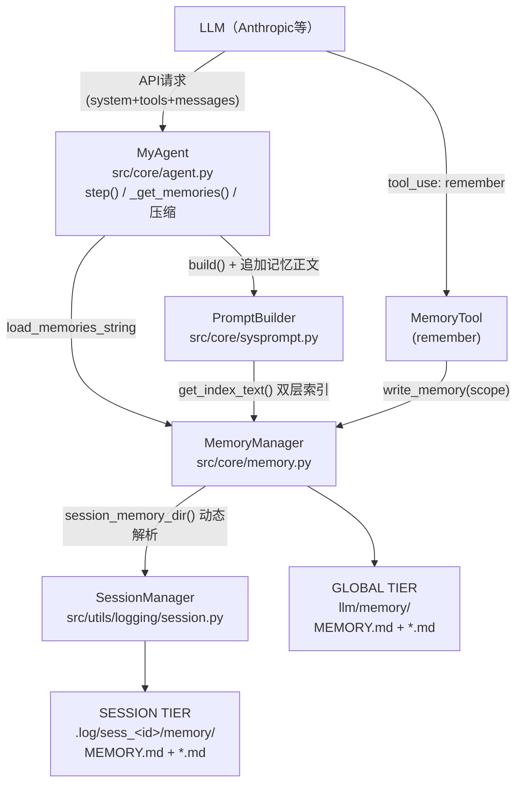

# Regent Memory 架构设计文档（双层记忆）

<!-- [toc] -->

## 一、概述

### 1.1 设计目标

Regent 的记忆子系统在 PR #21（commit `271c33f`）中完成了从"单层全局记忆"到"双层记忆"的重构，核心目标有三：

1. **隔离性**：会话分支内的临时事实不得泄漏到其他分支；项目级持久知识不得被会话数据淹没。
2. **注意力聚焦**：检索结果优先呈现当前会话的记忆（"注意力锚点"），再补充全局记忆。
3. **缓存友好**：System Prompt 的静态部分保持稳定，动态记忆放在 Prompt 尾部，最大化 LLM 前缀缓存命中率。

### 1.2 演进历程

| 阶段 | 形态 | 问题 |
| --- | --- | --- |
| v0（PR #3 之前） | 单层 `llm/memory/`，任务状态为全局 `llm/task/task_state.json` | 全局task_state跨会话共享；记忆无法表达"仅本次会话有效"的事实 |
| v1（本PR合入） | 双层记忆 + 会话级任务状态 | 见本文档 |
| 加固轮（R1-R3，合入本PR） | 无会话静默回退拦截、压缩预算绕过移除、原子写、文件名防护、ASCII策略 | 见 `playground/review_pr271c33f.md` |

设计决策的原始记录见全局记忆 `regent_memory_refactor_design`（`llm/memory/regent_memory_refactor_design.md`）。

---

## 二、总体架构

### 2.1 分层架构图

```
                      +-----------------------------+
                      |        LLM（模型）           |
                      |   tool_use / API请求        |
                      +--------------+--------------+
                                     |
          +--------------------------+---------------------------+
          |                     AGENT LAYER                      |
          |   MyAgent（src/core/agent.py）                       |
          |    step()  _get_memories()  _compact_context()      |
          +----+----------------+----------------+--------------+
               |                |                |
               | system prompt  | 相关记忆正文    | archives/artifacts
               | (build+追加)   | (缓存, 尾部)    | （会话目录下）
               v                v                v
          +-------------+  +----------------------------------+
          | PromptBuilder|  | SafeLLMClient                   |
          | (sysprompt)  |  | （相邻同角色消息归一化）          |
          +------+-------+  +----------------------------------+
                 | get_index_text()（双层索引合并）
                 v
          +==========================================+
          |             DOMAIN LAYER                 |
          |   MemoryManager（src/core/memory.py）     |
          |   读：list / select / load               |
          |   写：write_memory（防护链+原子写+索引）   |
          |   路径：session_memory_dir() 动态解析      |
          +----+-----------------------------+-------+
               |                             |
   session tier|                             | global tier（写默认）
               v                             v
          +-----------------+         +------------------+
          | SessionManager  |         | llm/memory/      |
          | (session.py)    |         |  GLOBAL TIER     |
          +--------+--------+         | MEMORY.md + *.md |
                   |                  +------------------+
                   v
          +------------------+
          | .log/sess_<id>/  |
          |  memory/         |
          |  SESSION TIER    |
          |  MEMORY.md + *.md|
          +------------------+

工具层（src/tool/agent/）
  MemoryTool（remember）      -> MemoryManager.write_memory()
  StateTool（update_state）   -> 会话级 task_state.json（见第八章）
```

### 2.2 Mermaid 版本（支持Mermaid的查看器可直接渲染）



### 2.3 三个核心设计点

1. **双层存储，一个Manager**：`MemoryManager` 同时管理全局层与会话层，通过 `scope` 参数区分读写目标；会话层路径由 `SessionManager` 动态解析，因此 CLI `checkout` 切换会话时**无需重建 Agent**，记忆作用域即随当前会话切换。
2. **索引（目录）+ 正文（检索）双通道注入**：System Prompt 中注入两层的 `MEMORY.md` 索引（全量、精简、供模型"知道有什么"）；同时按最近对话关键词检索出最多5条命中的记忆正文追加到 Prompt 尾部（供模型"读到内容"）。
3. **写入走防护链，读取零风险**：所有写入（记忆文件、索引、任务状态）经过 sanitize/撞名/保留名/长度/注入防护与原子写；所有读取对缺失、损坏、非法UTF-8文件静默跳过并告警，任何单文件异常都不会中断一次 turn。

---

## 三、磁盘布局与文件格式

### 3.1 目录结构

```
Regent/
├── llm/                                  # 全局知识（跨会话，运行时数据，已gitignore）
│   ├── memory/                           #  GLOBAL TIER
│   │   ├── MEMORY.md                     #    索引（<=200行，注入System Prompt）
│   │   ├── coding_style.md               #    记忆条目（frontmatter + 正文）
│   │   └── regent_memory_refactor_design.md
│   ├── skill/                            # 技能库（独立子系统，非memory）
│   └── task/
│       └── task_state.json.legacy-backup # 旧全局task_state（迁移后改名备份）
└── .log/
    └── sess_20260804_151550_256460/      # 单个会话分支
        ├── meta.log                      # 会话元数据（id/name/created_at）
        ├── history.log                   # 对话历史（含工具调用）
        ├── task_state.json               # 会话级任务状态（Attention Anchor）
        ├── memory/                       #  SESSION TIER
        │   ├── MEMORY.md                 #    索引
        │   └── review_pr271c33f_findings.md
        ├── artifacts/                    # 大工具输出offload（截断指针指向这里）
        └── archives/                     # 上下文压缩归档（append-only）
```

要点：

- 全局层是**跨会话**的"长期记忆"：编码风格、架构决策、用户偏好。
- 会话层是**分支内**的"短期记忆"：本次会话的目标、发现、临时结论；随会话目录一起存在，天然隔离。
- 两层的目录结构完全对称（`MEMORY.md` 索引 + `*.md` 条目），`MemoryManager` 用同一套逻辑处理。

### 3.2 记忆文件格式（frontmatter + 正文）

```markdown
---
name: pr271c33f_merge_status
description: Commit 271c33f (PR #21) merged all previously pending fixes into src/
tags: [regent, pr, merge-status]
updated_at: 2026-08-04 15:24:22
scope: global
---
正文内容（自由markdown）...
```

- 文件名由 `name` 经 `_sanitize_filename` 确定性转换（空白、路径分隔符、Windows保留字符 `\ / : ? * " < > |` 与CR/LF 替换为 `_`），保证"同名更新命中同一文件"。
- `updated_at` 与 `scope` 由系统写入；`_parse_frontmatter` 读取时对称解析。

### 3.3 索引文件（MEMORY.md）

每层一个 `MEMORY.md`，每行一条，由 `_update_index` 维护：

```markdown
- [pr271c33f_merge_status] Commit 271c33f (PR #21) merged ... (tags: regent, pr, merge-status) [updated: 2026-08-04 15:24:22]
```

- 同名更新时先按 `- [name]` 前缀去重再追加，避免重复条目。
- 超过200行时保留最新200行，防止索引把 System Prompt 撑爆。

---

## 四、组件详解

### 4.1 MemoryManager（领域核心，`src/core/memory.py`）

#### 4.1.1 职责总览

| 方法 | 职责 | 方向 |
| --- | --- | --- |
| `session_memory_dir()` | 动态解析会话层目录（session_manager优先，静态覆盖用于测试） | 路径 |
| `_dir_for_scope(scope)` | 写操作的目标目录；session无会话时抛 `ValueError` | 路径 |
| `list_memories(scope)` | 列出记忆（all/global/session），带 `scope` 标签 | 读 |
| `get_index_text()` | 合并两层 `MEMORY.md`，供 System Prompt 注入 | 读 |
| `select_relevant_memories(messages, max_items=5)` | 关键词检索：取最近3条用户消息文本，session层优先匹配 | 读 |
| `load_memories_string(messages)` | 将命中记忆渲染为 `<relevant_memories>` 块 | 读 |
| `write_memory(name, desc, tags, content, scope)` | 写入防护链 + 原子写 + 索引更新 | 写 |
| `_update_index(...)` | 索引去重、追加、200行上限、原子写 | 写 |

#### 4.1.2 路径解析（动态 vs 静态）

```python
def session_memory_dir(self):
    if self.session_manager is not None:
        return self.session_manager.get_session_memory_dir()   # 动态：checkout即切换
    return self._static_session_memory_dir                      # 静态：测试/独立使用
```

- 生产环境（`main.py`）总是传入 `SessionManager`，因此记忆作用域跟随当前会话，`checkout` 无需重建 Agent。
- 写操作解析：`scope='session'` 且无会话目录时**抛出 `ValueError`** 而非静默回退全局层——静默回退会把分支内事实泄漏到全局（数据隔离缺陷），这是加固轮修复的核心之一。

#### 4.1.3 读路径

1. `get_index_text()`：分别读取两层的 `MEMORY.md`，组装为两个 section（`## Global Project Memories ...` / `## Current Session Memories ...`），注入 System Prompt。
2. `select_relevant_memories()`：从历史中取最近至多3条纯文本用户消息拼接为检索串（截断2000字符），分词（长度>3）后对记忆的 `name + description` 做关键词匹配；**先session层后global层**，命中即选，最多 `max_items`（默认5）条。
3. `load_memories_string()`：把命中记忆渲染为带scope标签的 `<relevant_memories>` 文本块。

检索只用 `name + description`（不扫正文），保证每次 System Prompt 构建的低延迟与低成本；正文只有在命中后才注入。

#### 4.1.4 写路径（防护链）

`write_memory()` 按顺序执行以下防护，任何一步失败都以明确的错误返回，绝不静默：

```
name(scope)
  │
  ├─ 1. _dir_for_scope()        session且无会话 -> ValueError
  ├─ 2. _sanitize_filename()    非法字符 -> '_'
  ├─ 3. 长度守卫                空名或>100字符 -> ValueError（避免ENAMETOOLONG）
  ├─ 4. 保留名守卫              小写== "memory" -> ValueError（保护MEMORY.md索引）
  ├─ 5. 撞名守卫                文件已存在且frontmatter name不同 -> ValueError
  │                              （同名更新=正常语义，允许）
  ├─ 6. _frontmatter_clean()    name/desc/tags中的换行与'---'清洗（防注入/防拆块）
  ├─ 7. 原子写                  tmp文件 + os.replace（防半写文件）
  └─ 8. _update_index()         索引去重 + 追加 + <=200行 + 原子写
```

#### 4.1.5 索引维护

- 去重：`[l for l in index_lines if not l.startswith(f"- [{name}]")]`。
- 上限：`index_lines[-200:]`（保留最新）。
- 原子写：与记忆文件相同的 tmp + `os.replace` 模式。

### 4.2 MemoryTool（`remember` 工具，`src/tool/agent/memory_tool.py`）

| 关注点 | 实现 |
| --- | --- |
| 参数 | `name`（必填）、`description`、`tags`、`content`（必填）、`scope`（`global`默认 / `session`） |
| 语言策略 | 4个字段任一含非ASCII字符即拒绝并提示翻译（内部存储必须ASCII以保关键词检索） |
| 错误处理 | `ValueError`（防护链）与 `OSError`（磁盘）转为工具错误信息，不中断整个 turn |
| 缓存联动 | 成功后 `MyAgent._invalidate_memories_cache()`，下一轮tool loop立即反映新记忆 |

### 4.3 PromptBuilder（注入，`src/core/sysprompt.py`）

System Prompt 的 section 顺序（记忆相关部分标 `*`）：

```
1. 角色/环境  2. 技能说明  3. 工具用法
4. Security Rules（静态）
5. Language Policy（静态，ASCII策略来源）
6.* Memories 索引（get_index_text() 双层合并；位于尾部区域，prefix-cache友好）
7.* Current Task State（会话级 target/todos/completed，见第八章）
```

- `step()` 中再把命中的记忆正文 `<relevant_memories>` **追加到 `system` 字段最末尾**——`system` 是 payload 最后一个字段，追加它不会破坏 `tools + messages` 的前缀缓存。
- 记忆索引与正文同时注入是有意为之：索引给模型"目录"，正文给模型"细节"。

### 4.4 MyAgent（缓存与联动，`src/core/agent.py`）

- `_get_memories()`：以"最后一条纯文本用户消息的位置+内容hash"为key缓存记忆正文；tool loop期间该key不变，System Prompt 尾部保持稳定（缓存友好）；新用户消息到来时key变化，自动重算。
- 失效路径（三处）：
  1. `remember` 工具执行成功（`_invalidate_memories_cache`）；
  2. 上下文压缩后历史结构变化；
  3. `reload_history()`（CLI `checkout` 切换会话）：同时清空 `_last_system_prompt`，避免跨会话串用旧的token预算与任务状态。
- `_last_system_prompt`：供 `_soft_token_limit()` 估算"固定开销"，让压缩预算把记忆尾部计入，避免重复计数。

### 4.5 SessionManager（会话布局，`src/utils/logging/session.py`）

- `_ensure_session_layout(session_dir)`：每个会话目录自动创建 `memory/` 与 `task_state.json`；`create_session` 与 `switch_session`（懒初始化）都会调用，兼容旧会话。
- `get_session_memory_dir()` / `get_task_state_file()`：动态路径解析的唯一入口。
- `migrate_legacy_task_state()`：旧全局 `llm/task/task_state.json` 一次性幂等迁移到当前会话（仅当会话文件缺失或仍为默认占位），随后改名 `.legacy-backup` 防止旧代码继续读取。


---

## 五、数据流

### 5.1 写入时序（模型调用 `remember`）

```
  LLM/Agent              MemoryTool            MemoryManager                Filesystem
    |                        |                      |                            |
    | tool_use: remember     |                      |                            |
    |----------------------->|  1. ASCII校验        |                            |
    |                        |  2. scope合法性      |                            |
    |                        |  write_memory()      |                            |
    |                        |--------------------->|  3. _dir_for_scope()       |
    |                        |                      |     (session无会话->报错)  |
    |                        |                      |  4. sanitize + 长度/保留名  |
    |                        |                      |  5. 撞名检查              |
    |                        |                      |  6. frontmatter清洗       |
    |                        |                      |  7. 写 tmp 文件           |
    |                        |                      |     os.replace            |
    |                        |                      |     --------------------->| *.md
    |                        |                      |  8. _update_index()       |
    |                        |                      |     --------------------->| MEMORY.md
    |                        |  True/"saved"        |                            |
    |<-----------------------|                      |                            |
    | 9. _invalidate_memories_cache()               |                            |
```

### 5.2 读取时序（每次 `step()` 构建请求）

```
  MyAgent.step()          PromptBuilder             MemoryManager           SessionManager
      |                        |                         |                        |
      | 1. _compact_context()  |  （预算检查，压缩见附注）  |                        |
      | 2. _get_memories()     |                         |                        |
      |  (命中缓存则直接返回)    |                         |                        |
      |------------------------|  load_memories_string() |                        |
      |                        |------------------------>|  list_memories("all")  |
      |                        |                         |  _list_tier(global)    |
      |                        |                         |  _list_tier(session)   |
      |                        |                         |<-- get_session_memory_ |
      |                        |                         |     dir()              |
      |                        |  select_relevant(最近3条 |                        |
      |                        |  用户消息, session优先)   |                        |
      |                        |<------------------------|  命中<=5条             |
      | 3. build()             |  get_index_text()        |                        |
      |<-----------------------|  双层MEMORY.md合并        |                        |
      | 4. system_prompt = build() + 记忆正文（尾部）      |                        |
      | 5. payload -> SafeLLMClient（相邻同角色归一化）      |                        |
```

附注（压缩）：`_compact_context()` 以 token 预算为唯一开关，压缩前把全量历史归档到 `archives/`，压缩后历史中相邻同角色消息由 `SafeLLMClient._normalize_messages` 在API层合并，保证 provider 严格交替约束不被打断。

### 5.3 缓存生命周期

```
记忆缓存（_memories_key / _memories_cache）
  初始化        -> None / ""（首轮构建）
  新用户消息     -> key变化，重算（正常轮次）
  remember成功  -> 主动失效（立即反映新记忆）
  上下文压缩     -> 主动失效（历史结构变化）
  checkout      -> reload_history() 清空（换会话）
```

---

## 六、设计决策与权衡

| # | 决策 | 理由 | 代价/权衡 |
| --- | --- | --- | --- |
| D1 | 双层混合存储（global + session） | 项目级知识跨会话持久；分支事实按会话隔离，`checkout` 即切换作用域 | 同一主题可能在两层各存一份，检索时以session优先解决冲突 |
| D2 | session写无会话时抛错而非回退全局 | 静默回退=数据泄漏缺陷；错误显式化让调用方立即发现 | 独立/测试环境用session必须显式传 `session_memory_dir` |
| D3 | 索引（全量目录）+ 正文（top-5检索）双通道 | 索引让模型"知道有什么"，正文让模型"读到细节"；检索仅扫name+description保证低延迟 | System Prompt 存在索引/正文内容重复，token略有冗余 |
| D4 | 记忆正文追加到 `system` 字段末尾 | `system` 是payload最后字段，追加不破坏 `tools+messages` 前缀缓存 | 记忆变化频繁时会降低缓存收益，故引入缓存机制限制变化频率 |
| D5 | 关键词检索代替LLM相关性排序 | 确定性、零额外调用、快速 | 语义相关性弱；`safe_client`参数已预留，未来可升级LLM排序 |
| D6 | 写路径全防护链 + 原子写 | 文件名注入、撞名、保留名、半写文件、索引与内容不一致均为实际发生过或可预见的故障 | 代码量增加，但错误路径全部显式化 |
| D7 | ASCII-only 内部存储策略 | 内部检索按ASCII空白分词，非ASCII会破坏匹配；文件与task_state均注入System Prompt | 中文用户需先翻译再存（工具会明确提示） |
| D8 | 缓存key = 位置 + 内容前2000字符hash | tool loop期间尾部稳定；实现简单 | 用户消息仅在2000字符之后变化时不失效（低风险边缘） |
| D9 | 索引上限200行 | 防止索引撑爆System Prompt | 最旧条目从索引消失（文件仍在，仍可被关键词检索） |

---

## 七、健壮性与安全

| 风险 | 防护 |
| --- | --- |
| 文件名注入 / 路径穿越 | `_sanitize_filename` 替换路径分隔符与保留字符；文件名完全由sanitize结果决定 |
| 撞名覆盖（"a b" vs "a_b"） | 写前解析已存在文件的frontmatter name，不同名即拒绝 |
| 覆盖索引文件（记忆名"MEMORY"） | 保留名守卫（大小写不敏感） |
| ENAMETOOLONG | 长度守卫（sanitize后1-100字符） |
| frontmatter注入（换行/`---`拆块） | `_frontmatter_clean` 清洗全部元数据值 |
| 半写文件（进程崩溃） | 全部写入走 tmp + `os.replace` 原子替换 |
| 损坏/非法UTF-8记忆文件 | 读取时 `OSError`/`UnicodeDecodeError` 跳过并告警，不中断turn |
| 损坏task_state.json | `StateTool._load` 回退默认状态并告警；下次成功更新覆盖 |
| 磁盘/权限故障 | 工具层捕获 `OSError` 转为错误信息返回，不crash整个turn |
| 记忆泄漏到其他分支 | `_dir_for_scope` 的ValueError + 会话层目录随session隔离 |
| 跨会话缓存串用 | `reload_history()` 清空记忆缓存与 `_last_system_prompt` |

---

## 八、与任务状态（Task/Target）的关系

任务状态与记忆共享同一套会话布局与设计哲学，属于"Attention Management"整体方案：

- **存储**：`.log/sess_<id>/task_state.json`（会话级），与 `memory/` 同级；旧全局文件迁移后备份。
- **工具**：`StateTool`（`update_state`）——合并语义（只更新传入字段）、原子写、ASCII校验、损坏容错。
- **注入**：`PromptBuilder` 第7节渲染为 `## Current Task State (Attention Anchor)`，含 target / todos / completed，并提示模型"必须频繁使用 update_state 保持更新"。
- **联动**：记忆（`remember`）回答"我该记住什么"，任务状态（`update_state`）回答"我现在在做什么"；两者都注入System Prompt，共同构成Agent的注意力锚点。

---

## 九、扩展方向

1. **语义检索**：`MemoryManager` 已预留 `safe_client`，可将关键词匹配升级为embedding或LLM相关性排序（保留关键词fallback）。
2. **记忆整理/合并**：超过索引上限或条目老化时，可定期用LLM合并相似主题、降级session->global（需显式确认）。
3. **测试合入**：当前仓库无自动化测试（review发现F1），建议将 `playground/tmp/smoke_review.py` 的思路整理为 `tests/` 套件，覆盖防护链与双tier行为。
4. **清理策略**：`artifacts/` 与 `archives/` 目前append-only，可加入按会话大小/时间的滚动清理。

---

## 十、参考资料

- 代码：`src/core/memory.py`、`src/core/sysprompt.py`、`src/core/agent.py`、`src/tool/agent/memory_tool.py`、`src/tool/agent/state_tool.py`、`src/utils/logging/session.py`、`src/utils/safe_llm/safe_llm.py`
- PR：commit `271c33f`（Feat: Memory and Task/Target #21），完整diff见 `playground/tmp/pr271c33f.diff`
- Review报告：`playground/review_pr271c33f.md`
- 冒烟测试：`playground/tmp/smoke_review.py`
- 设计决策记忆：`llm/memory/regent_memory_refactor_design.md`
